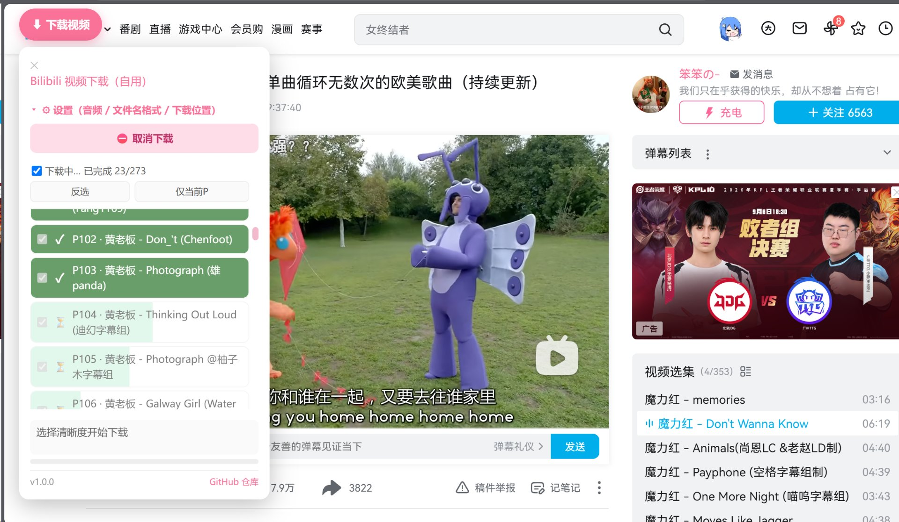
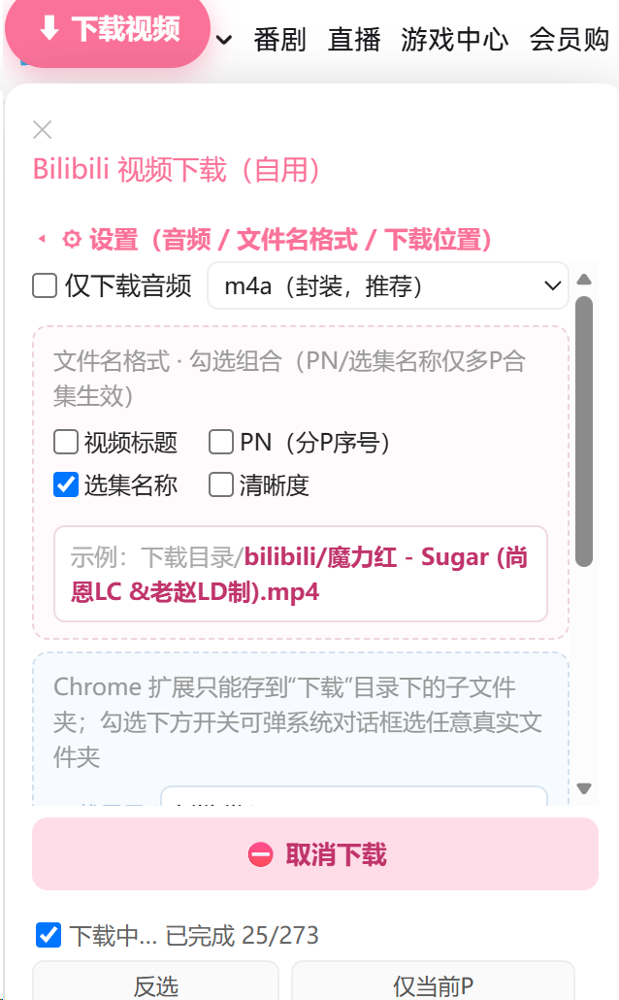
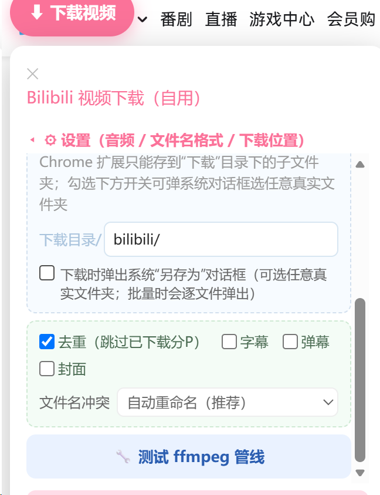

# Bilibili 视频下载器（Bili-DL）

> 在 B 站视频播放页注入一个可拖动的浮动按钮，一键下载当前视频（含多 P 合集批量下载）。
> 内置 `ffmpeg-core.wasm` 在**本地**完成音视频合并 / 转码，**离线可用、不依赖任何 CDN**。

[](https://github.com/my788525/bili-dl-ext/releases/latest)
[](LICENSE)

---

## 功能介绍

| 功能 | 说明 |
| --- | --- |
| 单 P / 多 P 下载 | 打开任意 B 站视频页，浮动按钮即为当前视频；多 P 合集可在弹窗里**逐 P 勾选**批量下载 |
| 内置 ffmpeg 合并 | `ffmpeg-core.wasm` 随扩展打包，合并 / 转码在扩展自带 Offscreen 文档内本地完成，无需联网、不受 CDN 失效影响 |
| 仅下载音频 | 勾选「仅下载音频」可直出 `m4a`（封装）或 `mp3`（转码） |
| 自定义文件名 | 视频标题 / PN（分 P 序号）/ 选集名称 / 清晰度 四个元素**可独立开关**，并实时预览示例文件名 |
| 行内进度反馈 | 每个分 P 一行，用**颜色填充宽度**表示进度；完成后整行变深绿 + 对勾，互不阻塞 |
| 浮动按钮可拖动 | 按钮可拖到页面任意位置并**记忆位置**；面板自动跟随按钮定位 |
| 下载位置 | 可指定「下载」目录下的相对子文件夹；亦可勾选弹系统「另存为」对话框选任意真实文件夹 |
| 去重 / 字幕 / 弹幕 / 封面 | 可选跳过已下载分 P；可选附带字幕、弹幕、封面 |
| 文件名冲突策略 | 自动重命名 / 覆盖 / 每次询问 三种 |
| **静默下载** | 默认开启。开启后走 **File System Access API** 直接写入你授权的目录，**不弹浏览器下载栏、不逐文件弹窗**；不支持该 API（如 Firefox）或拒绝授权时自动回退到普通下载 |
| **并发下载** | 可设 1 路（单文件依次，最稳，排查卡顿时用）或 2–6 路多线程；默认 3 路，大合集提速且不阻塞 |
| 版本检测 | 面板内显示当前版本，打开时自动对比 GitHub 上的 `version.json`，发现新版本弹出更新提示与下载入口 |
| GitHub 链接 | 面板底部常驻仓库链接，便于反馈问题、查看更新日志 |

---

## 特色功能

- **真正离线合并**：很多同类工具依赖远程 ffmpeg CDN，一旦 CDN 失效就罢工。本扩展把 `ffmpeg-core.wasm`（约 24MB）随包内置，首次加载后浏览器缓存，之后**完全离线**可用。
- **进度不卡死**：历史上「卡 99% / 卡 100% / 卡保存中」的元凶，是过度依赖一条易丢失的汇总消息。本扩展改为**本地真相源 + 行内独立进度**——每个分 P 各自推进，某条进度消息丢失也不会让 UI 卡住。
- **多 P 互不影响**：批量下载时各分 P 在自己的行内独立推进，慢的一条不会拖住快的一条。
- **拖动记忆的浮动按钮**：不想按钮占右下角？拖到屏幕任意位置，下次打开自动回到原位。
- **内建版本检测**：不用去商店也能知道有没有新版，面板里点一下直达下载。

---

## 📸 截图 / Screenshots

<p align="center">
  
  
  
</p>

<p align="center">
  <em>① 多 P 批量下载（每行独立进度，不阻塞、不卡 99%）</em><br>
  <em>② 自定义文件名（标题 / PN / 选集名称 / 清晰度 自由勾选）</em><br>
  <em>③ 下载位置 / 去重 / 字幕·弹幕·封面 / 冲突策略</em>
</p>

---

## 支持的浏览器

| 浏览器 | 内核 | 推荐安装方式 | 备注 |
| --- | --- | --- | --- |
| Chrome | Chromium | 解压加载（见下） | **不支持**安装外部 `.crx` |
| Edge | Chromium | 解压加载 / 企业策略 | 可用解压加载；CRX 仅限企业策略或开发者侧载 |
| Brave | Chromium | 解压加载 | 同 Chrome |
| Opera | Chromium | 解压加载 | 同 Chrome |
| Firefox | Gecko | 暂未适配 | 本扩展为 MV3 + Chromium API，Firefox 需另行适配（欢迎 PR） |

> ⚠️ **关于 CRX**：自 Chrome 33 起，浏览器**禁止从非网上应用店安装外部 `.crx`**（会报「无法从非网上应用店添加应用、扩展程序和用户脚本」）。因此本仓库的 `.crx` 包**仅供 Edge 企业策略侧载 / 自用签名场景**；绝大多数普通用户请使用下方的 **ZIP 解压加载**，这是最通用、最可靠的方式。

---

## 安装说明

### 方式一：ZIP 解压加载（推荐，所有 Chromium 系浏览器通用）

1. 到 [Releases](https://github.com/my788525/bili-dl-ext/releases/latest) 下载 **`bili-dl-ext.zip`** 并解压到一个固定目录（**不要删掉这个目录**，扩展从它读取文件）。
2. 打开浏览器的扩展管理页，开启「开发者模式」：
   - **Chrome**：地址栏输入 `chrome://extensions`
   - **Edge**：`edge://extensions`
   - **Brave**：`brave://extensions`
   - **Opera**：`opera://extensions`
3. 点击「**加载已解压的扩展程序**」（Load unpacked），选择第 1 步解压出来的目录。
4. 固定扩展到工具栏（可选）。打开任意 B 站视频页，右下角（或你拖动到的位置）会出现「⬇ 下载视频」按钮。

> 解压目录请放在不会随系统清理 / 软件卸载被删除的地方。移动或删除该目录会导致扩展失效。

### 方式二：CRX 安装（仅限 Edge 企业策略 / 自用签名场景）

普通 Chrome / Edge 双击 `.crx` 会被拒绝。仅当以下条件之一成立时才可用：
- 通过 **Windows 组策略** 将扩展加入「强制安装的扩展」白名单，并指向本地 `.crx`；
- 使用企业 / 开发者证书对 `.crx` 重新签名后分发。

因此 **99% 的用户请走方式一**。`.crx` 包保留在 Release 中，仅为满足「自托管 / 离线分发」需求。

### 各浏览器解压安装速查

- **Chrome**：`chrome://extensions` → 右上打开「开发者模式」→ 「加载已解压的扩展程序」→ 选目录。
- **Edge**：`edge://extensions` → 左下打开「开发人员模式」→ 「加载解压缩的扩展」→ 选目录。
- **Brave**：`brave://extensions` → 右上打开「开发者模式」→ 「加载已解压的扩展程序」→ 选目录。
- **Opera**：`opera://extensions` → 右上打开「开发者模式」→ 「加载已解压的扩展」→ 选目录。

---

## 使用说明

1. 打开 B 站视频页（`https://www.bilibili.com/video/BVxxxx`）。
2. 点击浮动按钮「⬇ 下载视频」打开面板。
3. 多 P 合集：在列表里勾选要下载的分 P（顶部有「全选 / 全不选 / 反选 / 仅当前 P」）。
4. 按需调整设置：仅音频、文件名格式、下载位置、去重、字幕 / 弹幕 / 封面、冲突策略。
5. 点击「下载选中」，各分 P 行内进度条推进；完成后该行变深绿 + 对勾，全部完成弹 Toast 提示，并**自动取消本次勾选**（方便下次直接下载）。

---

## 设置项说明

- **仅下载音频**：只抓取音轨，输出 `m4a`（封装，无损、体积小）或 `mp3`（转码，兼容性最好）。
- **文件名格式**：视频标题 / PN / 选集名称 / 清晰度 四元素可独立开关，下方实时预览示例文件名。单 P 视频无 PN / 选集概念，相关开关自动忽略。
- **下载位置**：Chrome 扩展只能存到「下载」目录下的相对子路径（自动建目录）；勾选「弹出系统对话框」可走真实「另存为」选任意文件夹（批量时逐文件弹窗）。
- **去重**：跳过已在「下载」目录下存在同名文件的已下载分 P（按 cid 记忆）。
- **字幕 / 弹幕 / 封面**：可选附带下载。
- **文件名冲突**：`自动重命名`（推荐）/ `覆盖` / `每次询问`。
- **静默下载（推荐）**：默认开启。首次下载时会弹出一次系统目录选择框（例如选「下载/BiliDL」），之后所有文件**直接写入该目录、不弹浏览器下载栏**；该授权会被记忆，下次免选。若想恢复普通下载（每文件弹下载栏），取消勾选即可。
- **并发下载**：`单文件依次（1 路）` 最稳，适合排查「批量下载卡顿 / 浏览器假死」时使用；`2–6 路` 为多线程，默认 3 路，合集越大提速越明显。注意：并发越高对网络与磁盘写入压力越大，如仍感卡顿请降到 1 路。

---

## 版本检测与更新

- 面板底部常驻显示当前版本号（如 `v1.0.0`）与「GitHub 仓库」链接。
- 每次打开面板会自动请求 `version.json`（仓库 `main` 分支根目录），与本地版本比对。
- 若发现新版本，面板内弹出更新横幅「⬆️ 发现新版本 X.X.X！前往下载」，点击直达 Release 页。
- 当前为离线侧载扩展，**不会自动更新**，需手动下载新版本 ZIP 并重新「加载已解压的扩展程序」（指向同一目录即可覆盖更新）。

---

## 隐私与免责

- 扩展仅在你主动打开 B 站视频页时运行，**所有音视频合并 / 转码均在本地完成，不会上传任何数据**。
- 取流请求直接发往 B 站官方接口（与网页端一致），不经由任何第三方服务器。
- 版本检测仅请求本仓库的 `version.json`，不含任何个人信息。
- 本工具仅供个人下载**你自己拥有权限**的内容（如已购、已投币、自己上传的视频）之备份用途；请遵守 B 站《用户协议》及当地法律法规，勿用于批量爬取、再分发等侵权场景。
- 本项目与哔哩哔哩官方无关，仅供学习与技术交流。

---

## 目录结构

```
bili-dl-ext/
├── manifest.json          # 扩展配置（MV3）
├── content.js             # 注入页面：UI / 任务调度 / 进度反馈 / 版本检测
├── background.js          # Service Worker：WBI 签名 / playurl / 落盘 / 消息中转
├── offscreen.js           # Offscreen 文档：ffmpeg-core 主线程合并 / 转码
├── offscreen.html
├── popup.html / popup.js  # 工具栏弹出页（ffmpeg 内置说明）
├── ffmpeg-core.js         # Emscripten 包装
├── ffmpeg-core.wasm       # ffmpeg 核心（约 24MB，随包内置）
├── key.pem                # CRX 签名私钥（稳定扩展 ID 用，详见下方「构建」）
├── version.json           # 版本检测数据源
├── README.md
└── LICENSE
```

---

## 构建 / 开发者

> 普通用户无需构建，直接下载 Release 的 ZIP 即可。以下供想自己打包 / 改代码的开发者参考。

### 本地改代码后重新加载

修改任意源文件后，回到扩展管理页点击该扩展卡片上的「**重新加载**」（↻）即可，无需重新加载整个目录。

### 打包 CRX（可选）

CRX3 需要一对 RSA 密钥（仓库已含 `key.pem`，用于保持扩展 ID 稳定）。如需自行重新打包：

```bash
# 使用 crx3 工具（Node）
npm i -g crx3
crx3 ./bili-dl-ext/* -o bili-dl-ext.crx   # 需指向含 key.pem 的目录
```

或使用 Chrome 自带命令行（需已安装 Chrome）：

```bash
chrome --pack-extension=./bili-dl-ext --pack-extension-key=./bili-dl-ext/key.pem
```

> 注意：公开仓库中保留 `key.pem` 是为了让每次打包出的 CRX 扩展 ID 一致（便于更新与识别）。它**仅用于 CRX 签名**，不代表对任何用户的设备有控制权；若你分叉本项目并公开发布，建议替换为自己的密钥。

### 打包 ZIP（解压安装包）

将仓库内除 `.git`、`.workbuddy`、`key.pem`、`dist` 外的源文件打包为 ZIP 即可分发。

---

## 许可

[MIT License](LICENSE) © my788525

## 致谢

- [ffmpeg.wasm](https://github.com/ffmpegwasm/ffmpeg.wasm) 提供的 WebAssembly 版 ffmpeg 核心。
- 取流逻辑参考 B 站网页端播放器与社区公开分析。
